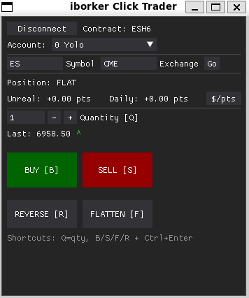
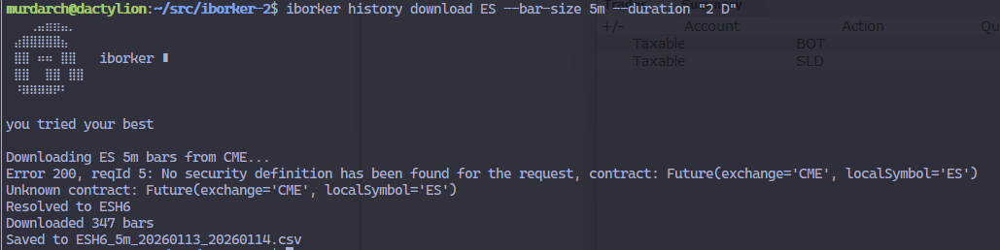
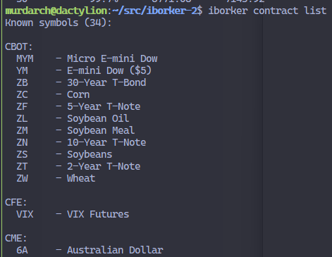
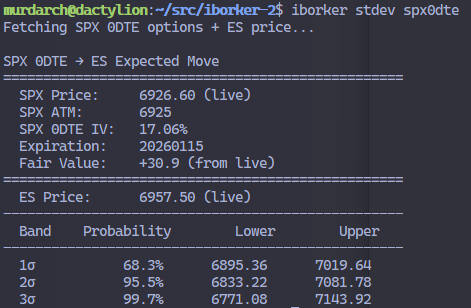

<p align="center">
  
</p>

# iborker

CLI and GUI tools for Interactive Brokers futures trading.

## Requirements

- Python 3.12+
- Interactive Brokers TWS or IB Gateway running with API enabled
- TWS API port configured (default: 7497 for paper, 7496 for live)

## Installation

```bash
uv sync
```

## Configuration

Create a `.env` file in your working directory:

```bash
# Connection settings
IB_HOST=127.0.0.1
IB_PORT=7497              # 7497=paper, 7496=live
IB_TIMEOUT=10.0
IB_READONLY=false

# Client ID management (for running multiple tools simultaneously)
IB_CLIENT_ID_MODE=auto    # "auto" or "fixed"
IB_CLIENT_ID_START=1      # Base for auto-allocated IDs
IB_CLIENT_ID=1            # Used when mode="fixed"

# Account nicknames for Click Trader dropdown
IB_ACCOUNT_NICKNAMES={"U1234567": "Main", "U7654321": "IRA"}
```

## Tools

### Click Trader (GUI)

Fast order entry GUI for futures trading.



[View connection demo video](docs/iborker-trader-connect.mp4)

```bash
iborker-trader
```

**Features:**
- One-click buy/sell/flatten/reverse
- Auto-selects front month contract (just type "ES", "NQ", etc.)
- Points-based P&L display (per-contract, position-size agnostic)
- Multi-account support with nicknames
- Keyboard shortcuts for rapid order entry

**Keyboard Shortcuts:**
| Key | Action |
|-----|--------|
| Q | Focus quantity input |
| B | Highlight BUY |
| S | Highlight SELL |
| F | Highlight FLATTEN |
| R | Highlight REVERSE |
| Ctrl+Enter | Execute highlighted action |
| P | Toggle points/dollars P&L |

**CLI flags:**
- `--no-roll-check` — skip the futures-roll lookup when setting a contract
- `--no-reverse` — remove the REVERSE button (forces enter–exit discipline)
- `--guardrails-on` — discipline mode (see below)

#### Guardrails mode

`iborker-trader --guardrails-on` enforces a pre-trade checklist, no-pyramid lock,
loss cooldowns, and a typed-reason gate for trading past your daily goal. Useful
if you have specific overtrading patterns to break.

Required env vars (trader exits at startup with a list of any missing):

| Var | Meaning |
|-----|---------|
| `IB_DAILY_GOAL` | Daily session goal in points; once cumulative ≥ goal, trade buttons disable until you re-arm with a typed reason |
| `IB_LOSS_COOLDOWN_THRESHOLD` | Per-trade realized loss (points) above which a cooldown triggers |
| `IB_LOSS_COOLDOWN_SECONDS` | Length of the loss cooldown |
| `IB_REARM_COOLDOWN_SECONDS` | Length of the post-re-arm cooldown |
| `IB_CLOCK_IN_COUNTDOWN_MINUTES` | (optional, default 15) length of the clock-in countdown |

Lifecycle (per session):

1. **Clock In** — all trade buttons disabled until you click *Clock In*. A countdown then runs.
2. **Checklist** — three free-text questions (≥20 chars each, tab-navigable) you have to answer.
3. **Arm prompt** — explicit yes/no to enable trading.
4. **Armed** — BUY / SELL / FLATTEN enabled. REVERSE is hidden in this mode.
5. **In position** — BUY and SELL disable; only FLATTEN exits.
6. **Cooldown** — a realized loss > threshold disables all trade buttons for the cooldown duration.
7. **Goal hit** — when cumulative points ≥ `IB_DAILY_GOAL`, trade buttons disable and a *Re-arm* button appears. Click it, type a reason, then wait out `IB_REARM_COOLDOWN_SECONDS`.
8. **Disconnect** resets the lifecycle to clocked-out — no persisted state across reconnects.

Clock-in time, checklist responses, and re-arm reasons are appended to
`workspace/journal/YYYY-MM-DD.md` (gitignored).

### Historical Data

Download OHLCV data for futures contracts.



```bash
# Download 5-minute bars (default)
iborker history download ES --duration "1 D"

# Download 1-minute bars
iborker history download ES --bar-size 1m --duration "1 D"

# Download 4-hour bars
iborker history download ES --bar-size 4h --duration "5 D"

# Download daily bars
iborker history download NQ --bar-size 1d --duration "1 Y"
```

Valid bar sizes: `1m`, `5m`, `15m`, `30m`, `1h`, `4h`, `1d`, `1w`

**Output columns:** `date`, `open`, `high`, `low`, `close`, `volume`, `average` (VWAP), `bar_count`

**Default filename:** `{contract}_{barsize}_{from}_{to}.csv` (e.g., `ESH6_5m_20250110_20250114.csv`)

### Contract Lookup

Look up contract details and margin requirements.



```bash
# Look up contract details
iborker contract lookup ES

# List known futures symbols
iborker contract list

# Query margin requirements
iborker contract margin ES --quantity 4
```

### Expected Move Calculator

Calculate expected price moves using options-implied volatility.



```bash
# Full analysis with sigma bands
iborker stdev analyze ES

# Quick daily expected move using SPX 0DTE options
iborker stdev spx0dte

# Get ATM implied volatility
iborker stdev iv ES

# Calculate expected move for specific timeframe
iborker stdev move ES --hours 24
```

## Supported Futures

The following contracts are pre-configured:

| Symbol | Name | Exchange | Multiplier |
|--------|------|----------|------------|
| ES | E-mini S&P 500 | CME | $50 |
| NQ | E-mini NASDAQ-100 | CME | $20 |
| YM | E-mini Dow | CBOT | $5 |
| RTY | E-mini Russell 2000 | CME | $50 |
| MES | Micro E-mini S&P 500 | CME | $5 |
| MNQ | Micro E-mini NASDAQ-100 | CME | $2 |
| CL | Crude Oil | NYMEX | $1000 |
| GC | Gold | COMEX | $100 |
| ZB | 30-Year Treasury Bond | CBOT | $1000 |
| ZN | 10-Year Treasury Note | CBOT | $1000 |

## License

MIT
